<div align="center">

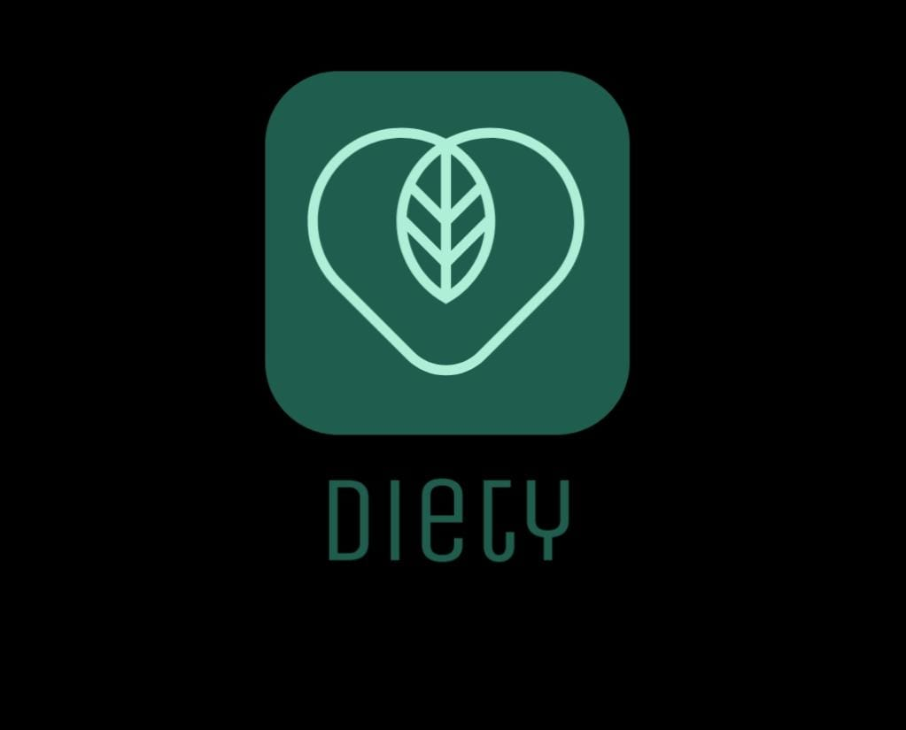

# 🥗 Diety — Your Smart Diet & Wellness Companion

[](https://flutter.dev)
[](https://firebase.google.com)
[](https://deepmind.google/technologies/gemini/)
[](https://flask.palletsprojects.com)
[](LICENSE)

**An intelligent, AI-powered diet and nutrition mobile application that helps users achieve their health goals through personalized meal planning, smart food tracking, exercise guidance, and a Gemini-powered AI chatbot.**

[Features](#-features) • [Architecture](#-architecture) • [Tech Stack](#-tech-stack) • [Getting Started](#-getting-started) • [Screenshots](#-screenshots) • [ML Model](#-machine-learning-model)

</div>

---

## 📖 About The Project

**Diety** is a graduation project Flutter mobile application designed to be your all-in-one personal diet and wellness assistant. It combines **AI/ML intelligence**, **real-time Firebase backend**, and a **beautiful modern UI** to deliver a truly personalized health experience.

Whether you want to **lose weight**, **gain muscle**, or **maintain a healthy lifestyle**, Diety crafts a custom nutrition plan tailored to your body metrics, activity level, and personal goals — and keeps you on track with smart notifications and an AI chatbot available 24/7.

---

## ✨ Features

### 🔐 Authentication
- Email & Password registration with **email verification**
- **Google Sign-In** integration
- **Facebook Login** integration
- Secure session management via Firebase Auth

### 🧭 Onboarding & Personalization
- Beautiful animated onboarding screens
- Collects user profile data:
  - **Gender** (with Lottie animation)
  - **Age**
  - **Height & Weight**
  - **Activity Level**
- Goal selection: **Lose Weight**, **Gain Weight**, or **Maintain**

### 🏠 Home Dashboard
- Daily calorie tracker with **visual progress indicators**
- **Water intake** reminders (automated via WorkManager)
- Macro breakdown (Protein, Carbs, Fats)
- Date-based meal timeline
- Real-time data sync with **Firebase Realtime Database**

### 🍽️ Meal Plans & Food Search
- **AI-generated personalized meal plans** (Breakfast, Lunch, Dinner, Snacks)
- Detailed nutritional information per meal
- Smart food search with calorie lookup
- Calorie logging per meal category

### 🤖 AI Chatbot (Gemini)
- Integrated **Google Gemini AI** chatbot
- Ask anything about nutrition, dieting, fitness, and healthy recipes
- Conversational interface powered by `dash_chat_2`

### 🏋️ Exercise & Fitness
- Exercise recommendations based on user goals
- Workout details with animated guides

### 🔔 Smart Notifications
- **Firebase Cloud Messaging (FCM)** for push notifications
- **Local notifications** for meal reminders
- **WorkManager** for background water-intake reminders scheduled throughout the day

### 👤 Profile Management
- Profile photo upload via **Firebase Storage**
- Edit personal details and goals
- View & update body metrics
- Contact support form

---

## 🏗️ Architecture

The project follows a **Feature-First** clean architecture pattern:

```
lib/
├── Core/
│   ├── model/
│   │   ├── UserInfo.dart              # User data model
│   │   ├── UserInfoProvider.dart      # Global state (Provider)
│   │   ├── notifications.dart         # Local notification service
│   │   ├── firenotifications.dart     # Firebase Cloud Messaging
│   │   └── workmanagerservice.dart    # Background task scheduler
│   ├── utils/                         # Shared utilities & helpers
│   └── widget/                        # Reusable UI components
│
└── features/
    ├── Auth/
    │   ├── Login.dart                 # Login screen
    │   └── SignUp.dart                # Registration screen
    ├── Splash/                        # Animated splash screen
    ├── Onboarding/                    # App introduction flow
    ├── User Detials/                  # User profile setup
    │   ├── Gender.dart
    │   ├── Age.dart
    │   ├── Height.dart
    │   ├── Weight.dart
    │   └── Activates.dart
    ├── User Goals/                    # Goal selection
    │   ├── Lose_weight.dart
    │   ├── Gain_weight.dart
    │   └── wishes.dart
    ├── Home/                          # Main dashboard
    ├── Planes/                        # Meal plans
    │   ├── Plane.dart
    │   └── PlaneDetails.dart
    ├── Search Food/                   # Food search & logging
    ├── Exersise/                      # Exercise tracker
    ├── Asks/                          # AI Chatbot (Gemini)
    ├── Admin/                         # Admin panel
    └── profile/                       # User profile & settings
        ├── profile.dart
        ├── gemini.dart
        ├── SetupPage.dart
        └── contact us.dart
```

---

## 🛠️ Tech Stack

### 📱 Mobile (Flutter)

| Category | Technology |
|----------|------------|
| **Framework** | Flutter 3.x (Dart) |
| **State Management** | Provider + Flutter BLoC |
| **UI / Animations** | Lottie, AnimatedSplashScreen, AnimatedTextKit |
| **Fonts** | Google Fonts (Poppins) |
| **Navigation** | Named Routes |
| **HTTP** | `http` package |
| **Local Storage** | SharedPreferences |
| **Image Handling** | ImagePicker, CachedNetworkImage |

### 🔥 Firebase Backend

| Service | Usage |
|---------|-------|
| **Firebase Auth** | Email/Password, Google, Facebook login |
| **Firebase Realtime Database** | User data, meal tracking, daily logs |
| **Cloud Firestore** | Structured data & meal plans |
| **Firebase Storage** | Profile photo uploads |
| **Firebase Messaging (FCM)** | Push notifications |

### 🤖 AI & Machine Learning

| Component | Technology |
|-----------|------------|
| **AI Chatbot** | Google Gemini AI (`flutter_gemini`) |
| **Diet Prediction Model** | Decision Tree Classifier (scikit-learn) |
| **ML API** | Flask (Python) REST API |
| **Data Processing** | Pandas, LabelEncoder |
| **Model Format** | Pickle (`.pkl`) |

### 🔔 Notifications & Background Tasks

| Service | Purpose |
|---------|---------|
| **WorkManager** | Background water-intake reminders |
| **flutter_local_notifications** | In-app meal-time alerts |
| **Firebase Cloud Messaging** | Server-pushed push notifications |
| **flutter_timezone** | Accurate timezone-aware scheduling |

---

## 🤖 Machine Learning Model

Diety uses a **Decision Tree Classifier** to generate personalized diet plans based on user data.

### Input Features
```python
{
  "Gender":   ["Male"],       # Encoded via LabelEncoder
  "Age":      [25],
  "Height":   [175],          # cm
  "Weight":   [80],           # kg
  "Activity": [1]             # Activity level (1–5)
}
```

### API Endpoint

```
POST /predict
Content-Type: application/json

Body: { "Gender": [...], "Age": [...], "Height": [...], "Weight": [...], "Activity": [...] }
```

### Running the Flask API

```bash
# Install dependencies
pip install flask scikit-learn pandas

# Start the server
python app.py
```

The server runs on `http://localhost:5000` and the `/predict` endpoint returns a recommended diet plan.

---

## 🚀 Getting Started

### Prerequisites

- [Flutter SDK](https://docs.flutter.dev/get-started/install) `>=3.2.0`
- [Dart SDK](https://dart.dev/get-dart) `>=3.2.0 <4.0.0`
- [Android Studio](https://developer.android.com/studio) or [VS Code](https://code.visualstudio.com/)
- A Firebase project (see [Firebase Setup](#firebase-setup))
- Python 3.x + pip (for the ML API backend)

### Installation

1. **Clone the repository**
   ```bash
   git clone https://github.com/MohamedRefky/Diety_app.git
   cd Diety_app
   ```

2. **Install Flutter dependencies**
   ```bash
   flutter pub get
   ```

3. **Configure Firebase**
   - Create a new project at [Firebase Console](https://console.firebase.google.com/)
   - Add an Android app and download `google-services.json`
   - Place it in `android/app/`
   - Enable: **Authentication**, **Realtime Database**, **Firestore**, **Storage**, **FCM**

4. **Configure API Keys**
   - Add your **Gemini API Key** in `lib/main.dart`:
     ```dart
     Gemini.init(apiKey: "YOUR_GEMINI_API_KEY");
     ```

5. **Run the app**
   ```bash
   flutter run
   ```

6. **Start the ML backend** (optional — for diet prediction)
   ```bash
   pip install flask scikit-learn pandas
   python app.py
   ```

---

## 📦 Key Dependencies

```yaml
# UI & Animations
animated_splash_screen: ^1.3.0
animated_text_kit: ^4.2.2
lottie: ^3.1.0
salomon_bottom_bar: ^3.3.2
percent_indicator: ^4.2.3
awesome_dialog: ^3.2.0
card_loading: ^0.3.2

# Firebase
firebase_core: ^2.27.1
firebase_auth: ^4.17.9
firebase_database: ^10.4.10
cloud_firestore: ^4.15.9
firebase_storage: ^11.6.10
firebase_messaging: ^14.9.1

# AI
flutter_gemini: ^2.0.3
dash_chat_2: ^0.0.20

# Notifications & Background
awesome_notifications: ^0.8.2
flutter_local_notifications: ^17.1.0
workmanager: ^0.5.2
flutter_timezone: ^1.0.8

# Auth (Social)
google_sign_in: ^6.2.1
flutter_facebook_auth: ^3.5.0

# State Management
flutter_bloc: ^8.1.5
provider: ^6.1.2
```

---

## 🔒 Environment Variables

> ⚠️ **Never commit API keys to public repositories.**

The following sensitive values should be stored securely:

| Variable | Description |
|----------|-------------|
| `GEMINI_API_KEY` | Google Gemini AI API key |
| `google-services.json` | Firebase Android configuration |
| Firebase `apiKey`, `appId` | Firebase project credentials |

Use [flutter_dotenv](https://pub.dev/packages/flutter_dotenv) or environment-specific config files to manage secrets safely.

---

## 📁 Project Structure Summary

```
diety/
├── android/                   # Android native code & config
├── ios/                       # iOS native code & config
├── lib/                       # Main Flutter source code
│   ├── Core/                  # Shared models, utils, widgets
│   └── features/              # Feature modules (Auth, Home, etc.)
├── assets/                    # Fonts, icons, static assets
├── Images/                    # App images and Lottie animations
├── app.py                     # Flask ML prediction API
├── decision_tree_model3.pkl   # Trained Decision Tree model
├── label_encoder.pkl          # Fitted LabelEncoder for gender
├── myproject_ml1.ipynb        # ML model training notebook
└── pubspec.yaml               # Flutter project configuration
```

---

## 📸 Screenshots

<div align="center">

<table>
  <tr>
    <td align="center">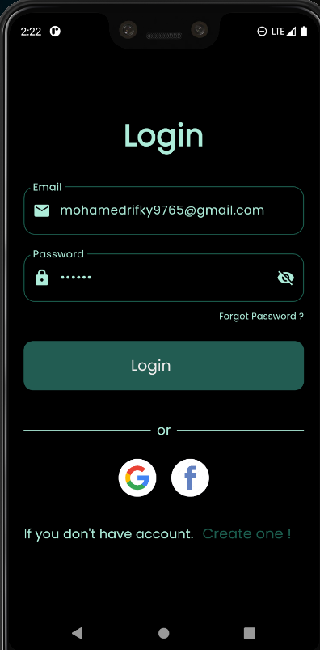</td>
    <td align="center">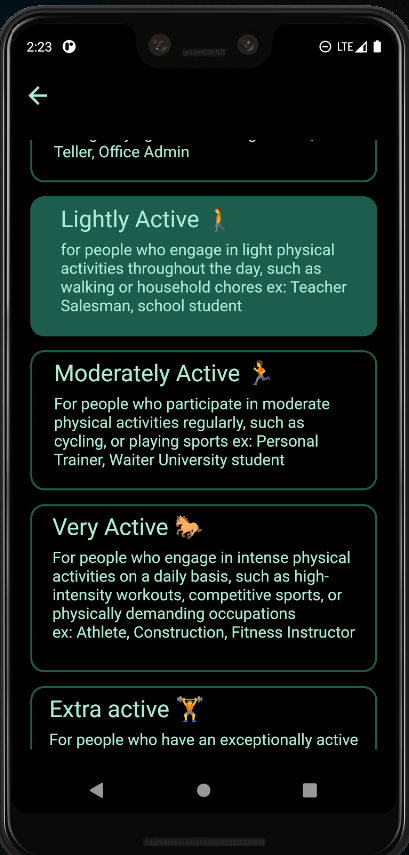</td>
    <td align="center">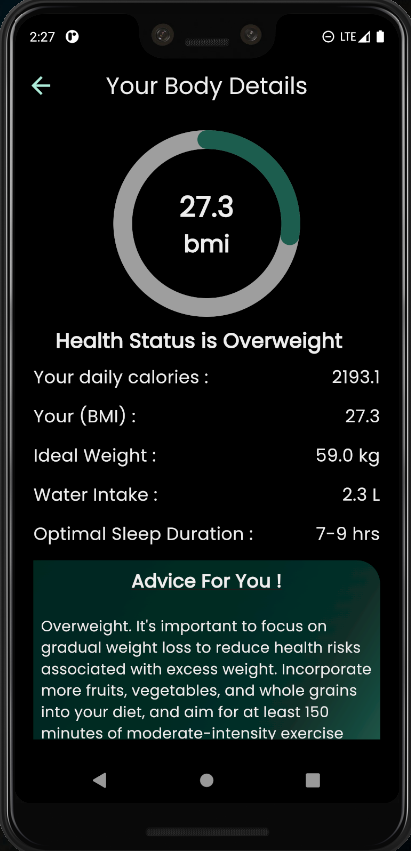</td>
  </tr>
  <tr>
    <td align="center">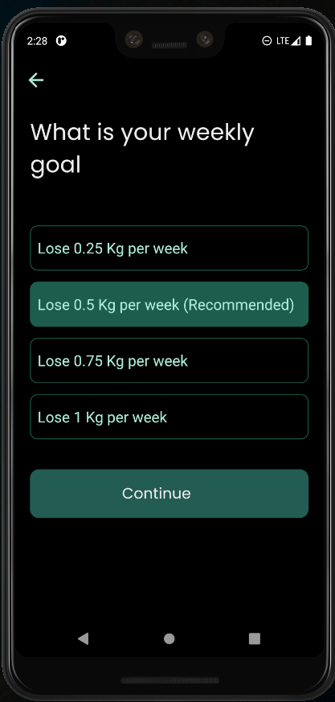</td>
    <td align="center">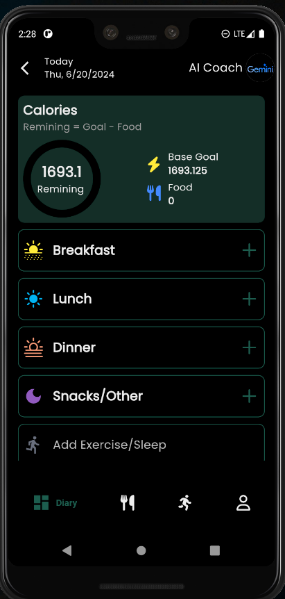</td>
    <td align="center">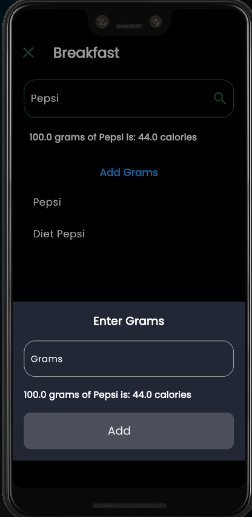</td>
  </tr>
  <tr>
    <td align="center">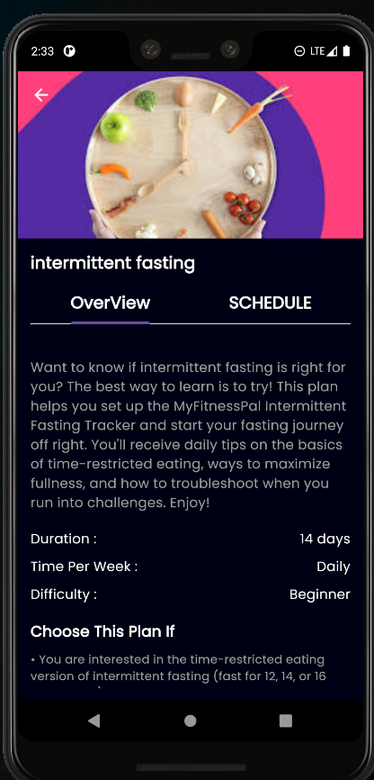</td>
    <td align="center">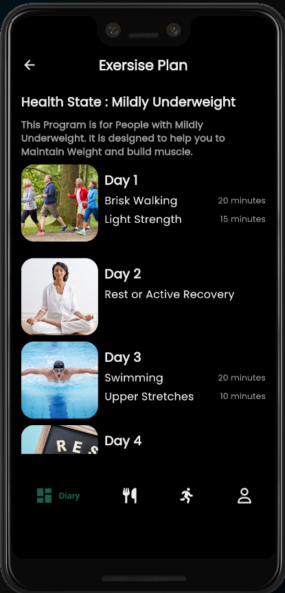</td>
    <td align="center">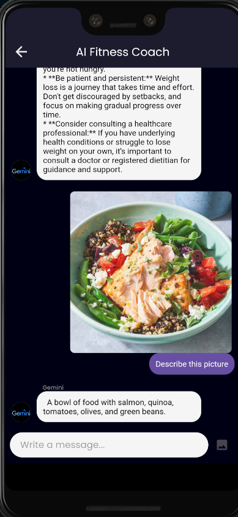</td>
  </tr>
  <tr>
    <td align="center">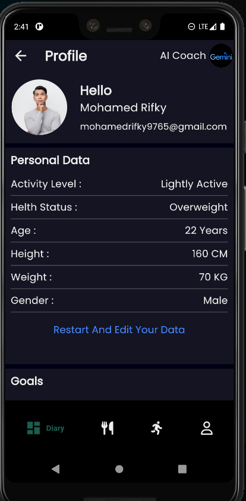</td>
    <td align="center"></td>
    <td align="center"></td>
  </tr>
</table>

</div>

---

## 🎓 About

This project was developed as a **Graduation Project** for a Computer Science program.

**Developer:** Mohamed Refky  
**Project Type:** Mobile Application (Graduation Project)  
**Platform:** Android (Flutter cross-platform)  
**Backend:** Firebase + Flask (Python ML API)  
**AI Integration:** Google Gemini

---

## 📄 License

This project is licensed under the **MIT License** — see the [LICENSE](LICENSE) file for details.

---

<div align="center">

Made with ❤️ using Flutter & Firebase

⭐ **Star this repo** if you found it helpful!

</div>